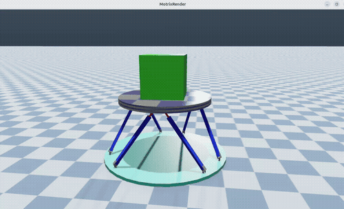

# StewartPlatformSim

This is a demo project that simulates a Stewart Platform using the MotrixSim framework.

# Installation

To install the project, you can use PDM to manage dependencies and environments. Make sure you have PDM installed, then run:

```bash
pdm install
```

# Usage

To run the simulation, you can execute the main script:

```bash
pdm run python main.py
```

Then you will get:


